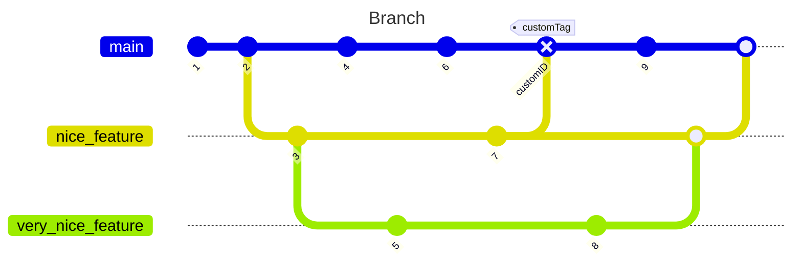

---
# try also 'default' to start simple
theme: dracula
# random image from a curated Unsplash collection by Anthony
# like them? see https://unsplash.com/collections/94734566/slidev
title: Git & GitHub Actios
info: |

class: text-center
highlighter: shiki
drawings:
  persist: false
transition: slide-left
mdc: true
---

# Git & GitHub Actions

Laboratorio de git

---

## Git - Configuración del entorno

 💡 Existen 3 archivos donde se puede guardar la configuración, Para ver la configuración completa se usa el comando `git config --list`

```bash{hide|1-2|4-5|7-8|all}
# A nivel SO  Archivo /etc/gitconfig
git config --system

# A nivel de un usuario  ~/.config/git/config
git config --global

# A nivel de repositorio .git/config
git config --local
```

---

## Configuracion inicial de Git

Lo siguiente es la configuracion básica para usar git, tras realizar su instalación.

```bash{none|1-2|4-5|7-8|10-11|all}
# Agregamos nuestro nombre de usuario
git config --global [user.name] “<nombre>”

# Agregamos nuestro correo
git config --global [user.email] <correo electronico>

# En algunos casos la rama por defecto es la master
git config --global init.defaultBranch main

# Mantener las credenciales en cache
git config --global credential.helper cache
```

<v-click>  Con las protestas de BLM en 2020, se puso en discusión el lenguaje racial en tecnología. Términos como amo, esclavo, blanco o negro pueden resultar dañinos sin necesidad. Muchos decidieron renombrar la rama "maestra" de GitHub a "principal". Siguiendo esta tendencia, GitHub cambió el nombre por defecto de esta rama especial a main.</v-click>

---

## Branches

- Las ramas en Git son versiones paralelas de un repositorio que permiten trabajar en diferentes características o versiones de un proyecto de forma independiente.
  
- La rama principal de un repositorio se llama generalmente **`main`** o **`master`**, y representa la versión estable y lista para producción del proyecto.

- Las ramas secundarias se utilizan para desarrollar nuevas características, corregir errores o realizar experimentos sin afectar la rama principal.

---




---

*Comandos más usados:*

- `git branch`: Muestra una lista de todas las ramas en el repositorio y resalta la rama actual.
- `git branch <nombre>`: Crea una nueva rama con el nombre especificado.
- `git switch <nombre>`: Cambia a la rama especificada, actualizando el directorio de trabajo con los archivos de esa rama.
- `git checkout -b <nombre>`: Crea una nueva rama con el nombre especificado y cambia a ella en un solo paso.
- `git merge <rama>`: Fusiona la rama especificada en la rama actual, combinando los cambios de ambas ramas.
- `git rebase <rama>`: Reorganiza la historia de los commits para que la rama actual se aplique sobre la rama especificada, creando una historia más lineal.
- `git push origin <rama>`: Envía los cambios de la rama local al repositorio remoto en la rama especificada.
- `git branch -d <nombre>`: Elimina la rama especificada.

---

# **Los Tres Estados de Git**


💡 Los archivos en Git pueden estar en tres estados: `confirmado`, `modificado` y `preparado`.


`Confirmado (Commited)` : significa que los datos están almacenados de manera segura en tu base de datos local. 

`Modificado (modified)`  : significa que has modificado el archivo pero todavía no lo has confirmado a tu base de datos. 

`Preparado (staged)`: significa que has marcado un archivo modificado en su versión actual para que vaya en tu próxima confirmación.

*Por lo tanto, un proyecto de Git tiene tres secciones: el directorio de Git, el directorio de trabajo y el área de preparación.*

---

1. Modificado es cuando has cambiado el archivo pero aún no lo has confirmado. 
    
    ```bash
    git init
    git clone
    ```
    
2. Preparado es cuando has marcado un archivo modificado para incluirlo en tu próxima confirmación. 
    
    ```bash
    git add
    ```
    
3. Confirmado es cuando los datos están seguros en tu base de datos local. 
    
    ```bash
    git commit
    ```
---
layout: cover
---
# Conceptos
## **Los conceptos básicos para trabajar  con git**
---

### Head

El concepto de `HEAD` es muy simple: se refiere al *commit* en el que está tu repositorio posicionado en cada momento. Por regla general `HEAD` suele coincidir con el último *`commit`* de la rama en la que estés, ya que habitualmente estás trabajando en lo último. Pero si te mueves hacia cualquier otro *`commit`* anterior entonces el `HEAD` estará más atrás.

### Main

Por regla general a *`main`* **se la considera la rama principal** y la raíz de la mayoría de las demás ramas. Lo más habitual es que en *`main`* se encuentre el "código definitivo", que luego va a producción, y es **la `rama` en la que se mezclan todas las demás tarde o temprano** para dar por finalizada una tarea e incorporarla al producto final

### Origin

**`origin`** es simplemente el nombre predeterminado que recibe el repositorio remoto principal contra el que trabajamos. Cuando clonamos un repositorio por primera vez desde **GitHub** o cualquier otro sistema remoto, el nombre que se le da a ese repositorio "maestro" es precisamente *`origin`*.

---

### Commit

Se define como un conjunto de cambios en los archivos que permite ver el historial. Cada `commit` tiene un identificador único generado con el algoritmo SHA.

### Tag

Un `tag` es una referencia a un punto específico del código, usado para volver a un punto anterior en el historial del repositorio. Si se elimina el commit o la rama principal, puede causar problemas. Se utilizan principalmente para el versionamiento.

```bash
git tag -a < nombre > -m “< descripción >”
git push --tags
```

### Ref

Nombre simbolico que apunta un `commit` especifiico, dentro una rama de un repositorio. Las referencias se encuentran el archivo `.git/refs`

### Refs

Directorio que hace referencia a todos los objetos del repositorio (Tags, branch…)

---

### Repositorio de git - Estructura

- *.git* : Corazón del sistema de control de versiones (Metadata: Historia, estiquetas, ramas, referencias , configuración global)
- *README* : Información del repositorio y su contenido, instrucciones básicas y ejemplos de uso, como contribuir al proyecto
- *LICENCE* : Establece los términos y condiciones bajo los cuales se puede usar, modificar y distribuir el software
- *.gitignore* : Todo lo que se desea excluir del control de versiones
- *.github* : Especifico para herramientas de github, como workflows
- *.docker* : Especifico para ficheros referentes a docker(Orquestaciones, ficheros de variables, repositorios de volumenes y aplicaciones)
- *src* : Código

---

### Estructura de un buen commit

El mensaje de un `commit` consiste en 3 diferentes partes separadas por una linea en blanco: el `titulo`, un `cuerpo` opcional y un `pie` opcional.

```bash{none|1|3|5|all}
<type>[optional scope]: <description>

[optional body]

[optional footer(s)]
```

> 💡 En caso de querer sobrescribir el commit utiliza el comando
`git commit -ammend -m <title> -m <description>`

### Regresar a otro commit

```bash{none|1-2|4-5|all}
#Buscamos el id del commit deseado
git checkout <id-del-commit>

#Para regresar al HEAD o commit anterior(original)
git switch -
```

---

### Tipos

- **feat**: Una nueva característica para el usuario.
- **fix**: Arregla un bug que afecta al usuario.
- **perf**: Cambios que mejoran el rendimiento del sitio.
- **build**: Cambios en el sistema de build, tareas de despliegue o instalación.
- **ci**: Cambios en la integración continua.
- **docs**: Cambios en la documentación.
- **refactor**: Refactorización del código como cambios de nombre de variables o funciones.
- **style**: Cambios de formato, tabulaciones, espacios o puntos y coma, etc; no afectan al usuario.
- **test**: Añade tests o refactoriza uno existente.
  
---

### Revertir cambios

> Mi compañero de trabajo sugirió en nuestras guías que preferimos la bandera `--force-with-lease` sobre `--force` para el comando `git push`. Esta opción permite forzar el push sin el riesgo de sobrescribir inadvertidamente el trabajo de otra persona. Actualizará las referencias remotas solo si tiene el mismo valor que la rama de seguimiento remoto que tenemos localmente. En otras palabras, solo si nadie ha actualizado la rama en el servidor. Si hay nuevos commits remotos, `--force-with-lease` fallará con un mensaje de "información obsoleta", instándonos a buscar primero. - Un Dev en StackOvewFlow


#### Git Reset

`git reset HEAD` te permite volver a un commit anterior elimina cualquier otro commit en su camino de regreso. Imagina a alguien trapeando un piso. Si alguien quiere limpiar un pasillo, no solo limpian el final. Trapean todo el piso hasta el final del pasillo. Este tipo de deshacer un error asegura que limpies todo en el camino de regreso al commit al que quieres volver. Por otro lado, esta es una opción destructiva y no guarda ningún historial de lo que eliminaste.

#### Git Revert

`git revert` crea un nuevo commit que es el opuesto al commit al que estás regresando. En lugar de eliminar todo hasta ese commit, simplemente haces una copia de este y avanzas con ese commit. No se destruyen commits en el proceso. Imagina si quisieras regresar 30 commits atrás. Si usaste `git reset`, se eliminarían todos esos 29 commits. `git revert` te permite conservar todo ese historial y crea una forma segura de avanzar.

---

## Git Stash

El comando git stash almacena temporalmente (stash) los cambios que hayas efectuado en el código en el que estás trabajando para que puedas trabajar en otra cosa y, más tarde, regresar y volver a aplicar los cambios más tarde. Guardar los cambios en stashes resulta práctico si tienes que cambiar rápidamente de contexto y ponerte con otra cosa, pero estás en medio de un cambio en el código y no lo tienes todo listo para confirmar los cambios.

- `git stash` Crea un stash
- `git stash save <descripción>` Ayuda a dar contexto
- `git stash list` Muestra los stash
- `git stash apply` Aplica los cambios del stash
- `git stash pop` Aplica los cambios del stash en la rama actual y elimina el stash de la memoria temporal

```bash
$ git stash list
stash@{0}: On main: add style to our site
stash@{1}: WIP on main: 5002d47 our new homepage
stash@{2}: WIP on main: 5002d47 our new homepage

$ git stash pop stash@{2}
```
---

### Flujo de trabajo recomendado

1. Clonar el repositorio
2. Crear rama local
3. Agregar los cambios
4. Integrar la rama de integración
5. Resolver conflictos si los hay
6. Hacer el push y el pull request

<br>

### Politicas recomendadas para activar en GitHub.

1. Cambiar la rama default por Develop
2. Crear reglas en el repositorio
    1. No permitir push directos a la rama develop
3. Definir una metodología con el equipo

---

### Versionamiento

| Característica    | SemVer                                                                                                | CalVer                                                                                        | shaVersion            |
|-------------------|-------------------------------------------------------------------------------------------------------|-----------------------------------------------------------------------------------------------|-----------------------|
| Significado       | Versión basada en significado semántico. Mayor.Minor.Patch. Ej: 1.2.3                                | Versión basada en calendario. Año.Mes.Día. Ej: 2022.01.15                                    | Versión basada en el hash SHA-1 de la confirmación más reciente. |
| Cambios           | Mayor: Rompe compatibilidad hacia atrás. Minor: Agrega funcionalidad de manera retrocompatible. Patch: Corrige errores de manera retrocompatible. | Los cambios importantes suelen requerir cambios en la versión principal o en la secundaria. Las correcciones de errores y las mejoras menores pueden reflejarse en la versión de parche. | No tiene una estructura fija de versiones, ya que depende del hash SHA-1 de la confirmación más reciente. |
| Ejemplo           | 2.0.16                                                                                                | 2022.01.15                                                                                   | c2d69e2               |